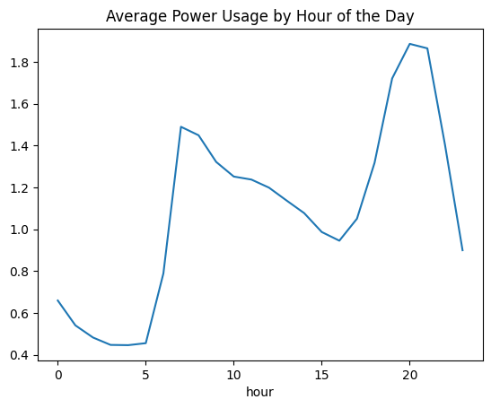
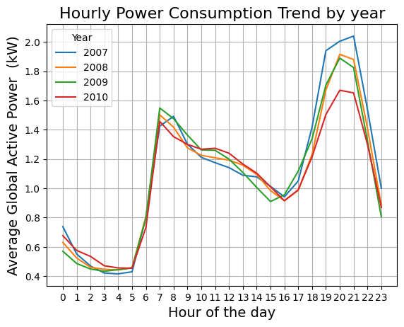
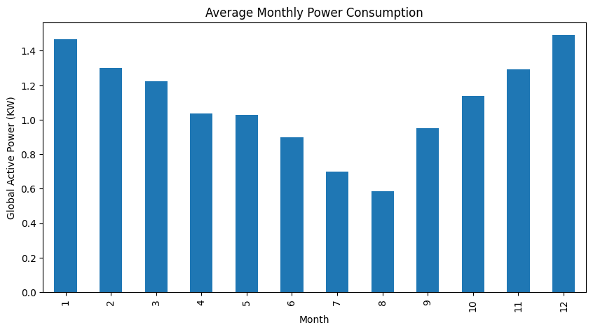
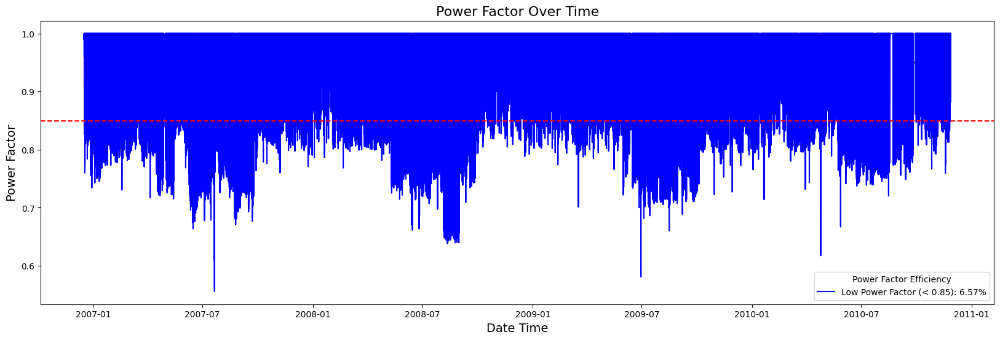
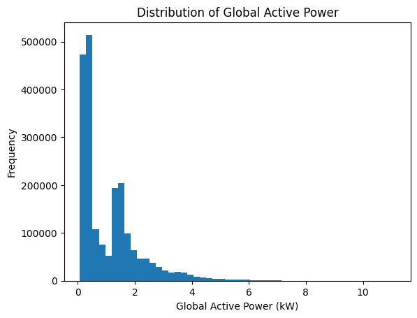
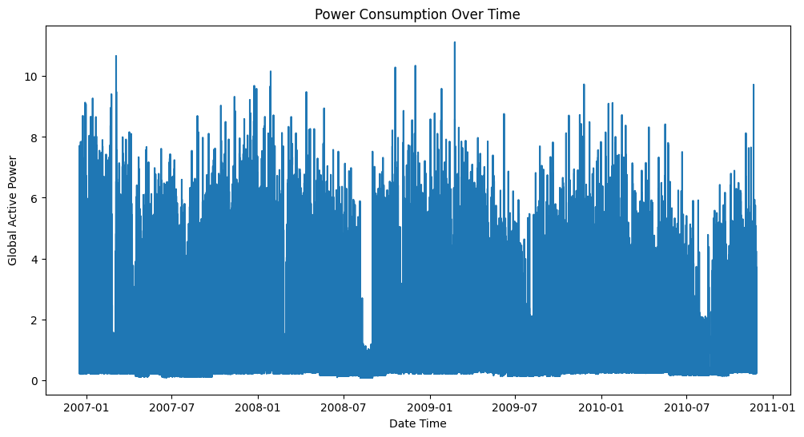
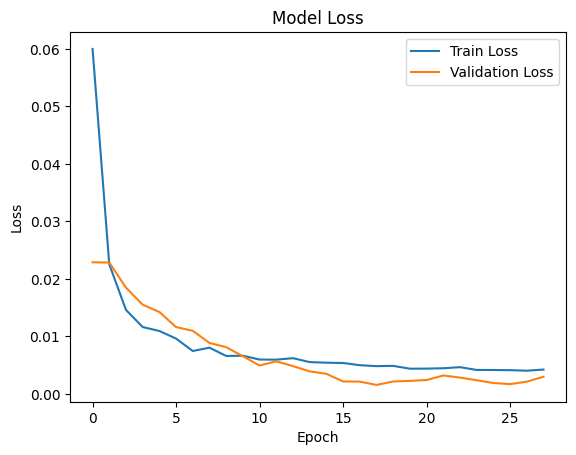

# Electrical-Power-Analysis-and-Prediction

# Time Series Forecasting with LSTM for Household Power Consumption

This repository contains code for time series forecasting of household power consumption data using a Long Short-Term Memory (LSTM) neural network built with TensorFlow/Keras.

## Dataset
Hebrail, G. & Berard, A. (2006). Individual Household Electric Power Consumption [Dataset]. UCI Machine Learning Repository. https://doi.org/10.24432/C58K54.

The dataset used is the "Household Power Consumption" dataset, which contains measurements of electric power consumption in one household with a one-minute sampling rate over a period of almost 4 years.

## Project Overview

This project aims to:

* Preprocess and prepare time series data for LSTM modeling.
* Build and train a bidirectional LSTM model for forecasting `Global_active_power`.
* Evaluate the model's performance using Root Mean Squared Error (RMSE) and R² score.
* Visualize training and validation loss curves.
* Demonstrate techniques like early stopping and inverse scaling.

## Files

* `main.py`: Contains the main Python script for data preprocessing, model building, training, and evaluation.
* `df_resample.csv`: Resampled daily mean data.
* `values.csv`: NumPy array of resampled daily mean data.
* `requirements.txt`: Lists the Python dependencies.

## Dependencies

* Python 3.x
* pandas
* numpy
* scikit-learn
* tensorflow
* matplotlib

## Results

### Image 1

### Image 2

### Image 3

### Image 4

### Image 5

### Image 6

### Image 7

